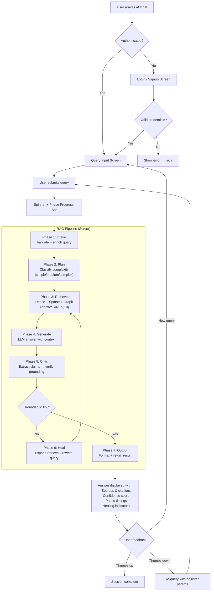
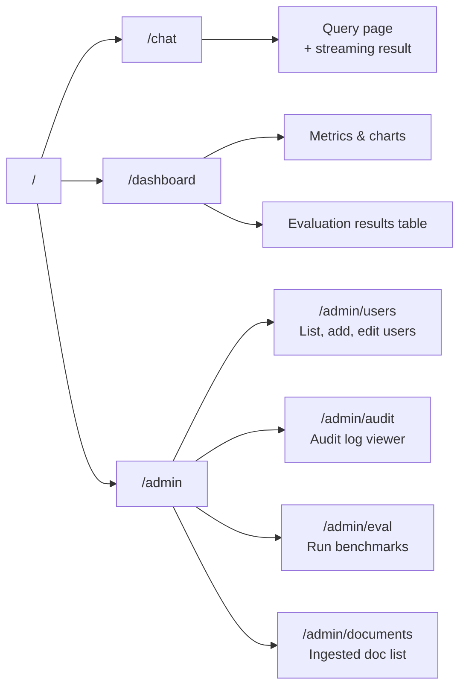
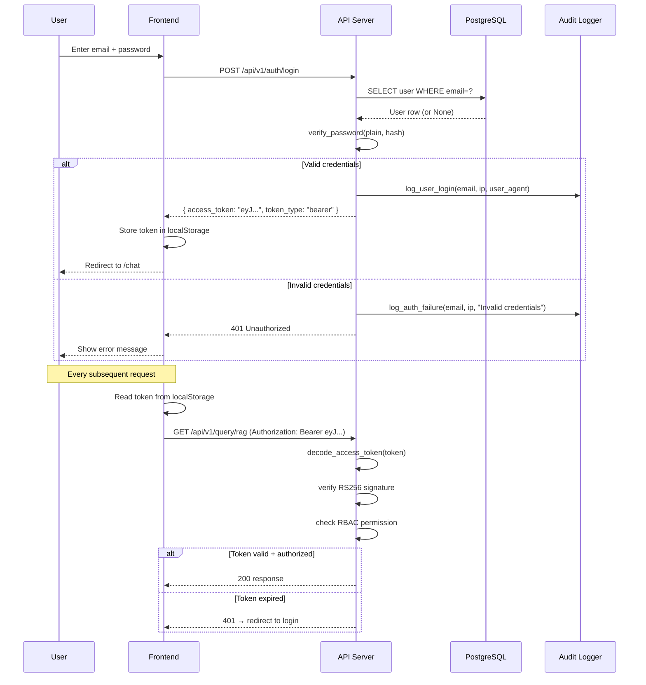
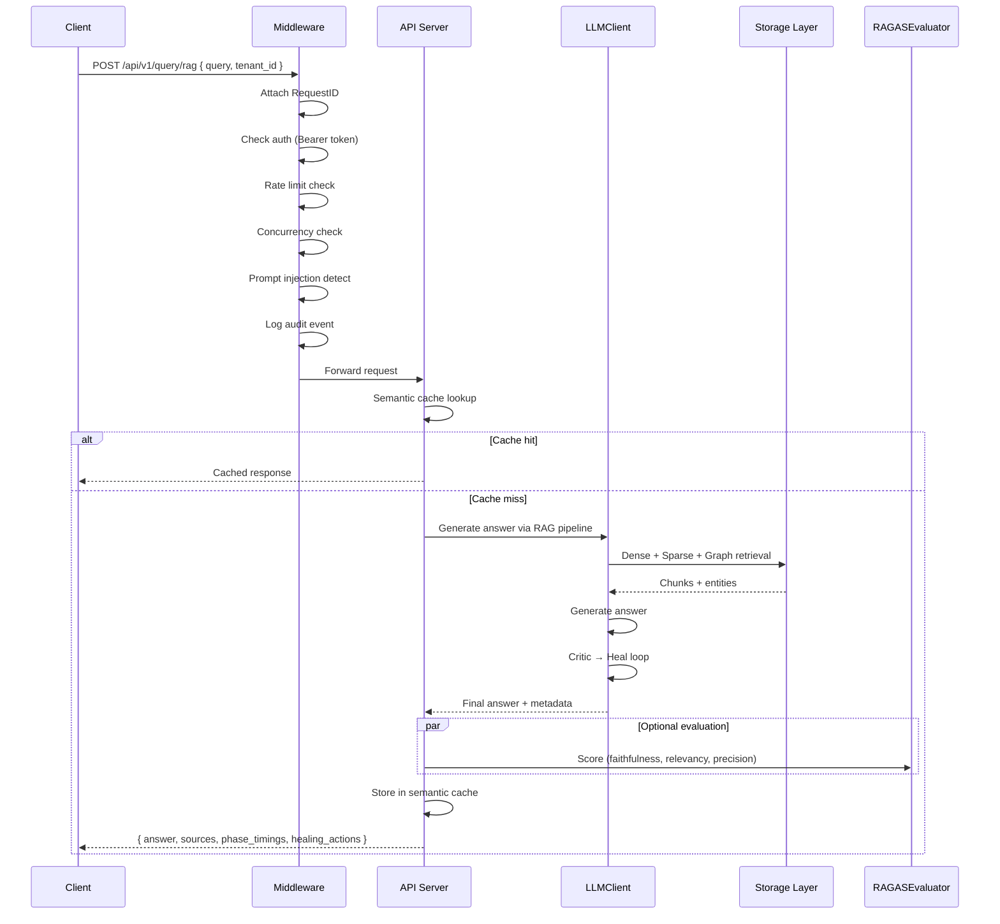
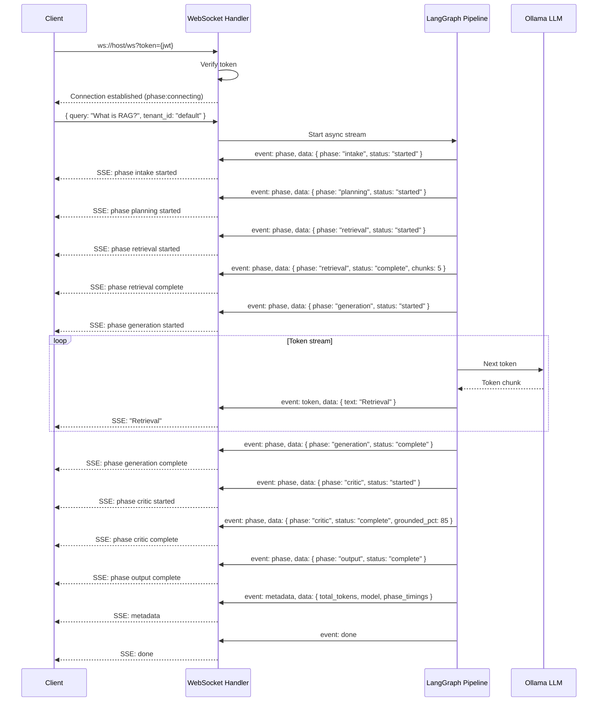
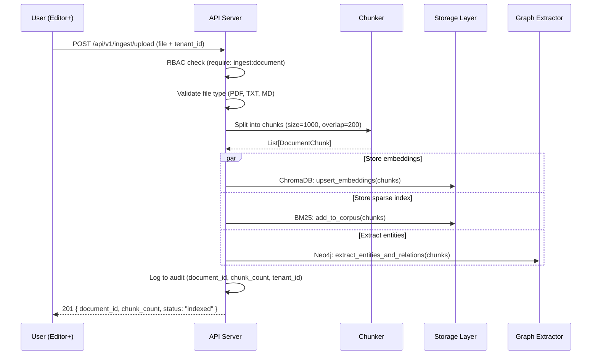
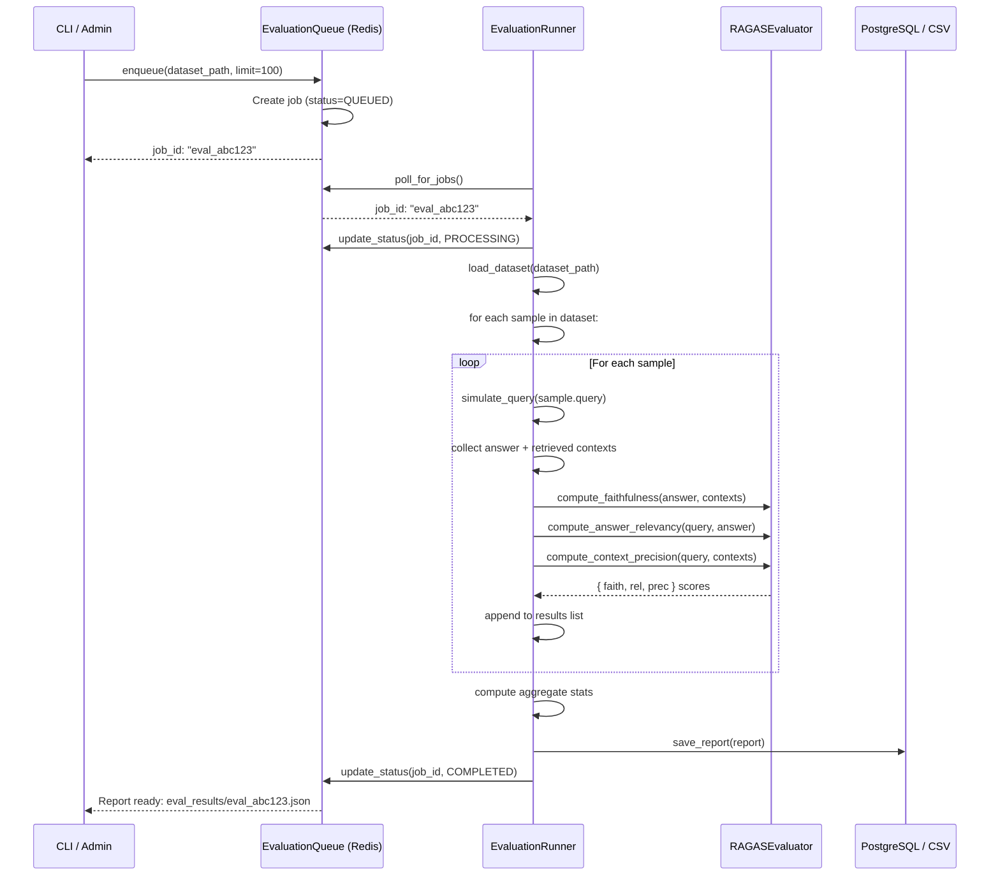
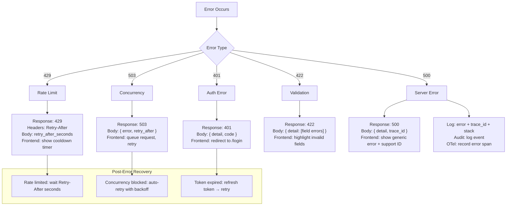

# Application Flow — Self-Healing RAG Pipeline

## Complete User Journey



## Entry Points

| Entry Point | URL | Auth Required | Description |
|-------------|-----|---------------|-------------|
| **Web Chat** | `/chat` | Yes | Primary RAG query interface |
| **API Query** | `POST /api/v1/query/rag` | Yes (Bearer) | Programmatic query access |
| **WebSocket** | `ws://host/ws?token={jwt}` | Yes (query param) | Streaming token-by-token response |
| **Health Check** | `GET /health` | No | Liveness + readiness probe |
| **Admin Dashboard** | `/admin/*` | Yes (admin+) | User management, audit log, eval runs |

## Navigation Flow



## Authentication Flow



## Main Feature Flows

### Query Flow (Synchronous)



### Streaming Query Flow (WebSocket)



### Ingestion Flow



### Evaluation Flow



## Error Handling Flow



## Admin Flow

```mermaid
sequenceDiagram
    participant A as Admin User
    participant F as Frontend
    participant API as API Server
    participant DB as PostgreSQL
    participant AUDIT as Audit Logger

    Note over A,F: User Management
    A->>F: Navigate to /admin/users
    F->>API: GET /api/v1/auth/users
    API->>API: RBAC check (require: users:manage)
    API->>DB: SELECT * FROM users
    DB-->>API: User list
    API-->>F: JSON user list
    F-->>A: Table of users with roles
    
    A->>F: Click "Change Role" on user
    F->>API: PATCH /api/v1/auth/users/{id} { role: "editor" }
    API->>API: RBAC check (require: roles:manage)
    API->>DB: UPDATE users SET role=?
    API->>AUDIT: log role change (admin_email, target_email, old_role, new_role)
    DB-->>API: Success
    API-->>F: 200 OK
    F-->>A: Role updated in table

    Note over A,F: Audit Log Viewing
    A->>F: Navigate to /admin/audit
    F->>API: GET /api/v1/audit/logs?limit=50&offset=0
    API->>API: RBAC check (require: audit:view)
    API->>DB: Read audit_logs table or files
    DB-->>API: Log entries
    API-->>F: Paginated log entries
    F-->>A: Filterable log table

    Note over A,F: Evaluation
    A->>F: Navigate to /admin/eval
    F->>API: GET /api/v1/eval/runs
    API-->>F: Previous evaluation run history
    A->>F: Click "Run Evaluation"
    F->>API: POST /api/v1/eval/run { dataset: "default" }
    API->>API: Enqueue evaluation job
    API-->>F: { job_id, status: "queued" }
    F-->>A: "Evaluation queued — check back"
    
    loop Poll every 5s
        F->>API: GET /api/v1/eval/jobs/{job_id}
        API-->>F: { status: "processing" }
    end
    
    API-->>F: { status: "completed", results_url }
    F-->>A: Show results summary with metrics