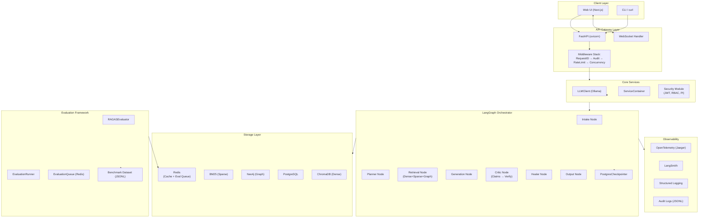
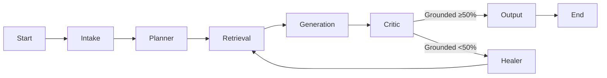
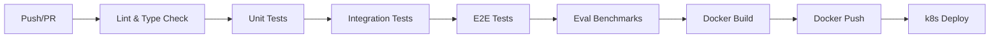

# Technical Requirements Document — Self-Healing RAG Pipeline

## System Architecture



## Technology Stack

| Layer | Technology | Version | Justification |
|-------|-----------|---------|---------------|
| **Runtime** | Python | 3.13+ | LangGraph ecosystem, async-native |
| **Web Framework** | FastAPI | 0.115+ | Async, OpenAPI auto-docs, middleware stack |
| **Orchestrator** | LangGraph | 0.2+ | Stateful graph execution, checkpointing |
| **LLM Backend** | Ollama | 0.5+ | Local first, model-flexible, no API key needed |
| **Default Model** | Mistral 7B | latest | Strong performance-to-size ratio for RAG |
| **Dense Vector Store** | ChromaDB | 0.6+ | Embedded, no external service in dev |
| **Sparse Search** | BM25 (in-process) | — | Zero-overhead keyword retrieval |
| **Graph Store** | Neo4j | 5+ | Entity-relationship traversal |
| **Relational DB** | PostgreSQL | 16+ | User data, checkpoints, eval history |
| **Cache / Queue** | Redis | 7+ | Semantic cache, eval job queue, rate limiter |
| **Authentication** | RS256 JWT | — | Asymmetric signing, zero trust compatible |
| **Observability** | OpenTelemetry | 1.30+ | Vendor-neutral traces, OTLP export |
| **LLM Observability** | LangSmith | — | Run-level LLM tracing |
| **Evaluation** | RAGAS | 0.2+ | Industry-standard RAG metrics |
| **Container** | Docker | 24+ | Reproducible builds |
| **Orchestration** | Kubernetes (k8s) | 1.30+ | Production scaling |

## Frontend Requirements

### UI Framework: Next.js 14+ (App Router)

| Requirement | Specification |
|-------------|---------------|
| Routing | App Router with `/chat`, `/dashboard`, `/admin` layouts |
| State Management | React Context + SWR for cache-first data fetching |
| Streaming | Server-Sent Events via `EventSource` for token streaming |
| Styling | Tailwind CSS v4 with design system tokens |
| Components | shadcn/ui (Radix primitives) |
| Auth Flow | OAuth2 Password Grant → Bearer token in `Authorization` header |
| Responsive | Mobile-first breakpoints: 640px, 768px, 1024px, 1280px |

### Screens

| Screen | Route | Purpose |
|--------|-------|---------|
| Chat | `/chat` | Primary query interface with streaming response |
| Dashboard | `/dashboard` | Usage stats, evaluation results, health status |
| Admin Users | `/admin/users` | User management (admin only) |
| Admin Audit | `/admin/audit` | Audit log viewer (auditor/admin) |
| Admin Eval | `/admin/eval` | Run and view evaluation benchmarks |

## Backend Requirements

### API Server: FastAPI + Uvicorn

| Requirement | Specification |
|-------------|---------------|
| Server | Uvicorn with ASGI lifespan |
| Workers | 4–8 gunicorn workers (k8s deployment) |
| Middleware order | RequestID → Audit → RateLimit → Concurrency |
| Routers | `/api/v1/auth`, `/api/v1/query`, `/api/v1/ingest`, `/ws` |
| Health endpoint | `GET /health` — returns service status |
| CORS | Limited to frontend origins (localhost:5173, :3000) |

### Service Container (`backend/graph/container.py`)

Singleton that initializes and provides:
- `LLMClient` — shared async Ollama wrapper
- `GenerationAgent` — answer generation
- `CriticAgent` — claim extraction + grounding verification
- `HealerAgent` — query rewriting
- `MemoryAgent` — semantic caching
- `RetrievalAgent` — hybrid dense/sparse/graph retrieval
- `PlannerAgent` — query decomposition
- `SummarizerAgent` — multi-document summarization

### LangGraph Pipeline

8-node state graph with the following phases:



## Database Requirements

### PostgreSQL 16

| Database | Schema | Purpose |
|----------|--------|---------|
| `self_healing_rag` | `public` | Users, tenants, eval history |
| Checkpoints (same DB) | `langgraph_checkpoint` | LangGraph state persistence |

### Redis 7

| Use | Key Pattern | TTL |
|-----|-------------|-----|
| Semantic cache | `cache:{query_hash}` | 1 hour |
| Rate limiter | `ratelimit:{client_id}:{endpoint}` | Window duration |
| Concurrency counter | `concurrency:{user_id}` | 60s |
| Eval queue | `eval:queue` / `eval:job:{job_id}` | 7 days (completed) |

### ChromaDB

Single collection per tenant: `rag_collection__{sanitized_tenant_id}`
- Embedding: `nomic-embed-text` (768d)
- Distance: cosine
- Metadata: `tenant_id`, `document_id`, `chunk_id`

### Neo4j

- Nodes: `Entity` with `name`, `type`, `description`
- Relationships: `RELATED_TO`, `MEMBER_OF`, `PART_OF`, `LOCATED_IN`

## API Requirements

### Authentication

| Endpoint | Method | Auth | Rate Limit |
|----------|--------|------|------------|
| `/api/v1/auth/signup` | POST | None | 5 req/min |
| `/api/v1/auth/login` | POST | None | 5 req/min |
| `/api/v1/auth/me` | GET | Bearer token | 60 req/min |

### Query

| Endpoint | Method | Auth | Rate Limit |
|----------|--------|------|------------|
| `/api/v1/query/rag` | POST | Bearer token | 60 req/min |
| `/api/v1/query/stream` | WebSocket | Token query param | — |

### Ingestion

| Endpoint | Method | Auth | Rate Limit | Role |
|----------|--------|------|------------|------|
| `/api/v1/ingest/upload` | POST | Bearer token | 60 req/min | editor+ |

### Admin

| Endpoint | Method | Auth | Role |
|----------|--------|------|------|
| `GET /api/v1/ingest/documents` | GET | Bearer token | viewer+ |
| `GET /api/v1/ingest/documents/{id}` | GET | Bearer token | viewer+ |
| `DELETE /api/v1/ingest/documents/{id}` | DELETE | Bearer token | admin |

## Authentication & Authorization

### JWT Token Structure (RS256)

```json
{
  "sub": "user@example.com",
  "exp": 1718000000,
  "iat": 1717395200,
  "role": "editor",
  "tenant_id": "uuid-abc-123",
  "user_uuid": "uuid-def-456"
}
```

### RBAC Matrix

| Permission | admin | editor | viewer | auditor |
|------------|-------|--------|--------|---------|
| `query:rag` | ✅ | ✅ | ✅ | ❌ |
| `query:stream` | ✅ | ✅ | ✅ | ❌ |
| `ingest:document` | ✅ | ✅ | ❌ | ❌ |
| `audit:view` | ✅ | ❌ | ❌ | ✅ |
| `users:manage` | ✅ | ❌ | ❌ | ❌ |
| `roles:manage` | ✅ | ❌ | ❌ | ❌ |
| `health:view` | ✅ | ✅ | ✅ | ✅ |

## Security Requirements

| Requirement | Implementation |
|-------------|----------------|
| Password hashing | bcrypt (via passlib) |
| Token signing | RS256, RSA-2048 keypair, auto-rotated in dev |
| Token expiry | 7 days |
| Rate limiting | Sliding window via Redis, fail-closed |
| Concurrency | Redis-based semaphore, global + per-user |
| Prompt injection | Heuristic scoring (length, encoding, keyword patterns) |
| Audit logging | JSONL files, 100 MB rotation, 10 backups |
| Tenant isolation | All queries filtered by `tenant_id` metadata |
| CORS | Whitelist only known frontend origins |

## Scalability Considerations

| Dimension | Strategy |
|-----------|----------|
| **Horizontal scaling** | Stateless API behind k8s Service; all state in Postgres/Redis |
| **Retrieval** | Adaptive k (3/5/10) prevents over-retrieval |
| **Caching** | Semantic cache deduplicates identical queries (1h TTL) |
| **Concurrency** | Hard limit of 50 global / 5 per-user concurrent requests |
| **Rate limiting** | Per-endpoint sliding windows prevent abuse |
| **LLM throughput** | Single Ollama instance; horizontal via model replication |
| **Evaluation** | Async Redis queue; offline batch processing |

## Deployment Strategy

### Environment Matrix

| Environment | Purpose | PG | Redis | Chroma | Neo4j | Ollama |
|-------------|---------|----|-------|--------|-------|--------|
| **dev** | Local development | Docker | Docker | Embedded | Docker | Local |
| **staging** | Pre-production | k8s | k8s | Docker | k8s | k8s |
| **prod** | Production | RDS | Elasticache | Docker | Neo4j Aura | k8s GPU |

### CI/CD Pipeline



## Monitoring & Logging

| Concern | Tool | Details |
|---------|------|---------|
| Application traces | OpenTelemetry → Jaeger | Auto-instrumented FastAPI + custom spans for each graph phase |
| LLM traces | LangSmith | Run-level traces, token usage, latency |
| Structured logs | Python `logging` → stdout | JSON format; parsed by Loki / Datadog |
| Audit logs | Custom JSONL files | Rotated locally; shipped to S3 monthly |
| Health checks | `GET /health` | Liveness + readiness probes in k8s |
| Metrics | OpenTelemetry metrics (future) | Request rate, error rate, p50/p95/p99 latency |
| Alerts | Prometheus + Alertmanager | P0: API down, P1: Faithfulness <0.7, P2: Latency >5s |