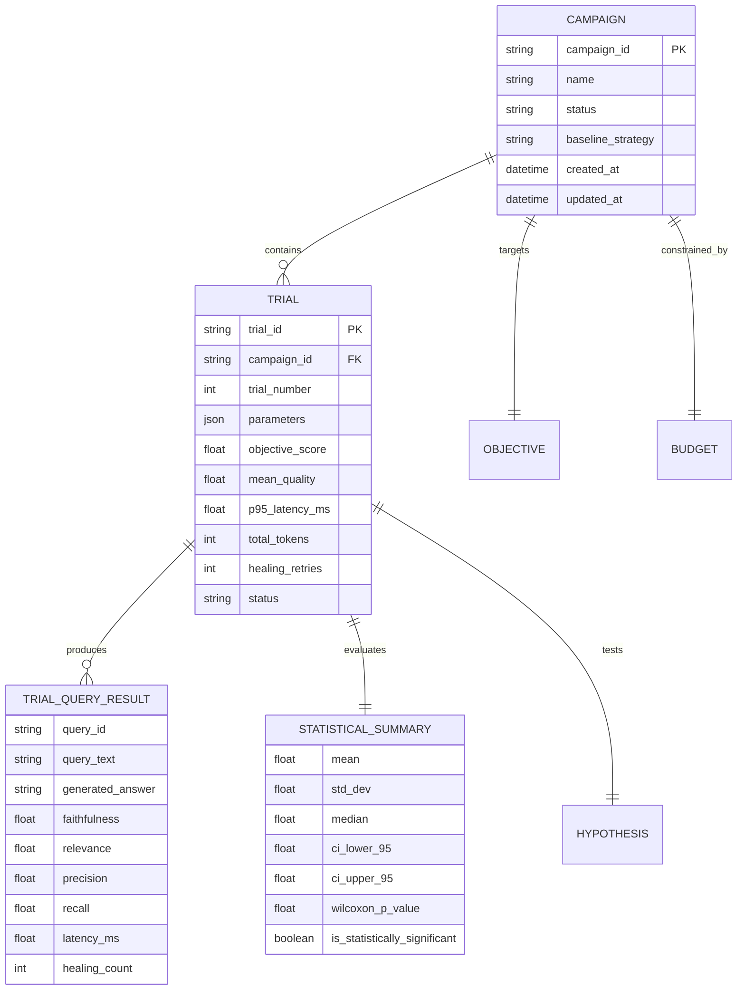

# Autonomous Experiment Scientist (AES) - Data Model Specification

## 1. Entity Overview
The AES data model captures campaigns, individual experiment trials, per-query telemetry, statistical evaluations, and scientific hypotheses.

## 2. Pydantic Schemas (Code Representation)
The core entities map directly to Pydantic v2 schemas in `backend/experiments/models.py`:
- `ObjectiveConfig`: Definition of weights, constraints, and latency targets.
- `BudgetConfig`: Resource caps, timeout limits, and circuit breakers.
- `CandidateProposal`: Structured hypothesis, parameter dictionary, and reasoning from the Scientist.
- `TrialQueryResult`: Fine-grained result of a single query in a trial.
- `StatisticalSummary`: Bootstrap confidence intervals and paired test metrics.
- `TrialResult`: Complete trial execution snapshot.
- `Campaign`: Top-level campaign container and trial leaderboard.
