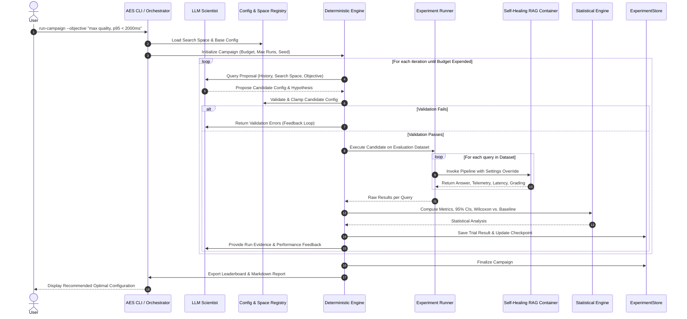

# Autonomous Experiment Scientist (AES) - System Design

## 1. Component Interactions and Workflow
The AES execution lifecycle proceeds through six structured stages:

## 2. Deterministic Isolation Mechanics
In standard multi-agent setups, configuration objects are prone to concurrency races or global side effects. AES enforces strict isolation:
1. **Immutable Base Configuration:** `backend.core.config.get_settings()` returns the production baseline and is never modified in place.
2. **Context-Local Overrides:** `Settings.with_overrides(**kwargs)` constructs a lightweight, copy-on-write `Settings` instance with modified fields.
3. **Container Rebuilding:** `ServiceContainer.build(settings_override)` instantiates isolated components (e.g. `HybridRetriever` with updated $\alpha$ and $k$) without polluting singletons or other active worker threads.
4. **Cache & Websocket Bypass:** When invoked within an experiment runner, requests pass `skip_cache=True` and `skip_websocket=True` to eliminate caching artifacts and unnecessary socket broadcasts.

## 3. Dataset Splitting & Quality Assurance
- **Dataset V1 (Golden Evaluation Set):** 20 curated test cases across factual, multi-hop, adversarial, and ambiguous question types with verified ground-truth contexts and reference answers.
- **Dataset V2 (Synthetic Candidate Pool):** LLM-generated document question-context-answer triples. Tagged with `status="candidate"` and filtered by automated validation heuristics before being flagged for human verification.
- **Data Versioning:** Every trial records the checksum and identifier of the exact dataset used (`dataset_v1@sha256`), guaranteeing reproducibility.
